# 📱 H5 Airtime App - Process Flow Diagrams

## 🔄 V1 Process Flow (Original UI)

### Complete V1 User Journey

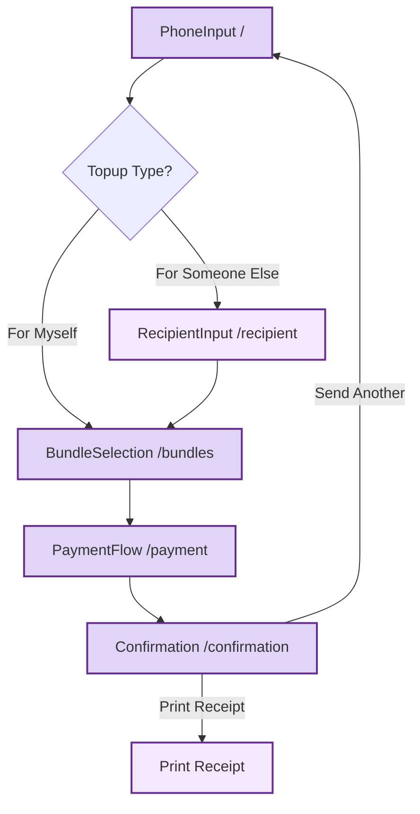

### V1 State Management Flow

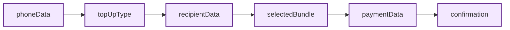

---

## 🔀 UI Version Switching Flow

### Version Switcher Logic

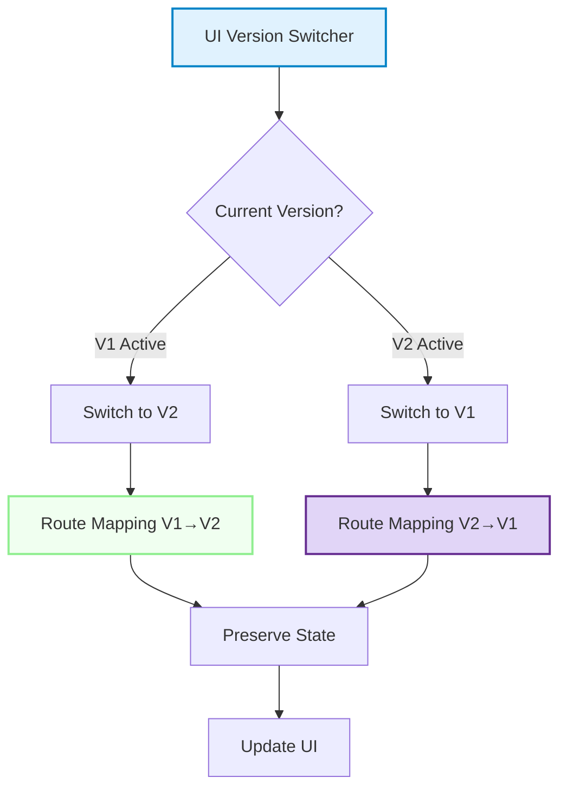

### Route Mapping Diagram

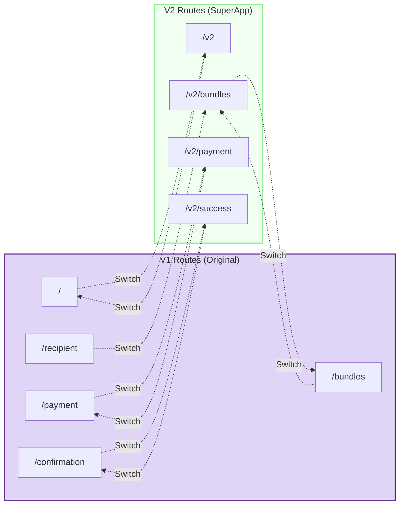

---

## 📊 Data Flow Architecture

### State Management Flow

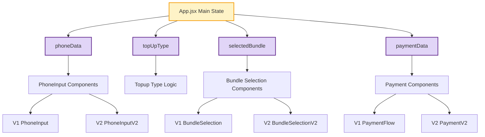

---

## 🔧 Technical Architecture

### Component Hierarchy

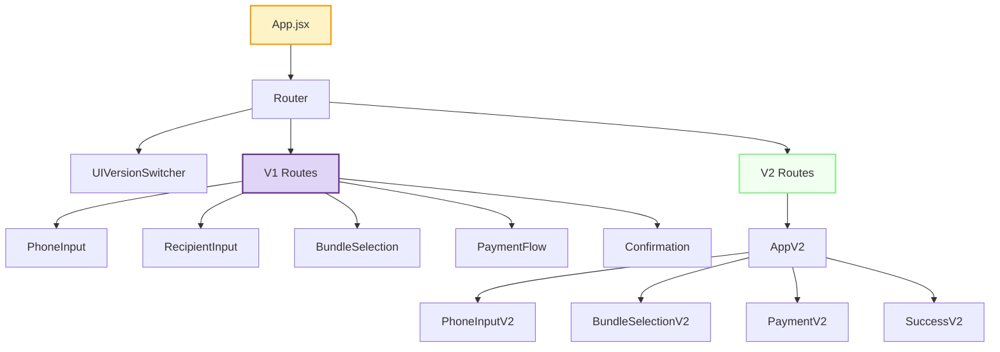

### Payment Processing Flow

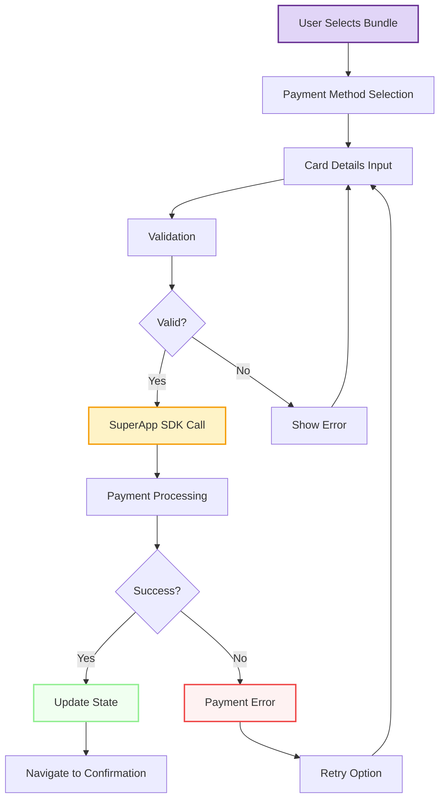

---

## 📱 Mobile User Experience Flow

### Touch Interaction Flow

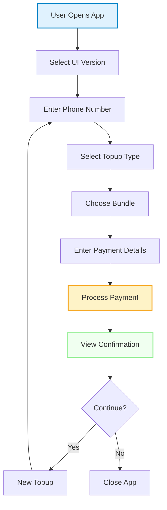

---

## 🔒 Security & Validation Flow

### Input Validation Process

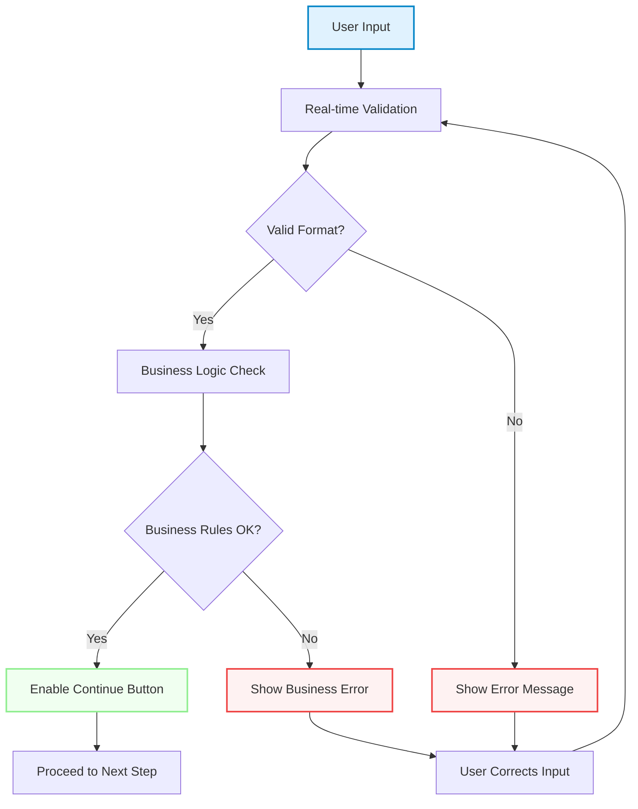

---

## 🎯 Success Metrics Flow

### Performance Tracking

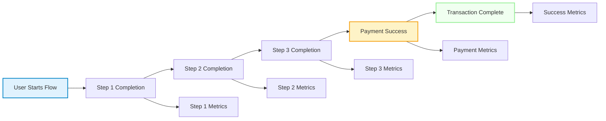

---

## 📋 Error Handling Flow

### Error Recovery Process

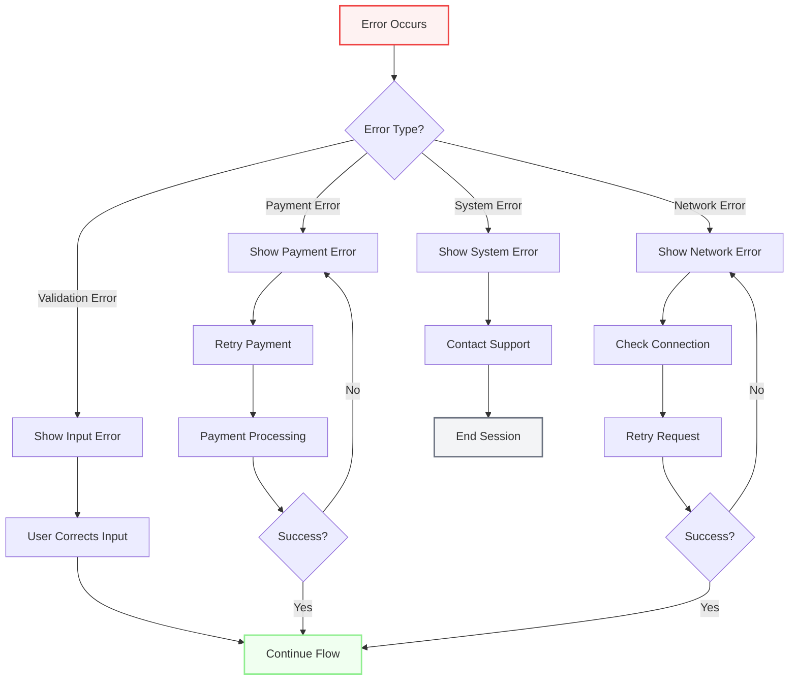

---

**These diagrams provide a comprehensive visual representation of the H5 Airtime app's process flows, architecture, and user journeys for both V1 and V2 interfaces.**
